# Supply Chain Resilience Co-Pilot — Architecture

> **Companion to** [supply_chain_copilot_PRD.md](supply_chain_copilot_PRD.md) (PRD v1.0). The PRD defines *what* and *why*; this document defines *how* — the modular structure, component boundaries, data and control flow, and the deployment topology that realise the requirements.

---

## Table of contents

1. [Architectural principles](#1-architectural-principles)
2. [System context (C4 L1)](#2-system-context-c4-l1)
3. [Layered / modular view](#3-layered--modular-view)
4. [Module boundaries & separation of concerns](#4-module-boundaries--separation-of-concerns)
5. [Agent orchestration (LangGraph StateGraph)](#5-agent-orchestration-langgraph-stategraph)
6. [End-to-end decision flow](#6-end-to-end-decision-flow)
7. [HITL escalation sequence](#7-hitl-escalation-sequence)
8. [ML-as-Tool serving layer](#8-ml-as-tool-serving-layer)
9. [Data pipeline & feature store](#9-data-pipeline--feature-store)
10. [Observability, evaluation & governance](#10-observability-evaluation--governance)
11. [MLOps: drift & retraining](#11-mlops-drift--retraining)
12. [State & persistence model](#12-state--persistence-model)
13. [Deployment topology](#13-deployment-topology)
14. [Framework portability (LangGraph → MAF)](#14-framework-portability-langgraph--maf)
15. [Proposed repository structure](#15-proposed-repository-structure)

**Part II — Architecture review & gap remediation**

16. [NFR → mechanism traceability](#16-nfr--mechanism-traceability)
17. [LLM reasoning boundary, determinism & safety](#17-llm-reasoning-boundary-determinism--safety)
18. [Security architecture & agent identity](#18-security-architecture--agent-identity)
19. [Failure modes & resilience](#19-failure-modes--resilience)
20. [Decision provenance & schema versioning](#20-decision-provenance--schema-versioning)
21. [Concurrency, scaling & performance budget](#21-concurrency-scaling--performance-budget)
22. [CI/CD & evaluation-as-quality-gate](#22-cicd--evaluation-as-quality-gate)
23. [Architecture Decision Records (seed)](#23-architecture-decision-records-seed)

---

## 1. Architectural principles

The architecture is governed by five principles. Every design decision below traces back to one of them.

| # | Principle | What it means in practice |
|---|---|---|
| **P1** | **ML-as-Tool, never LLM-as-predictor** | Trained models (Chronos-2, XGBoost, Isolation Forest) sit behind a typed tool interface. LLMs only *reason over* and *narrate* model outputs — they never generate predictions. The tool boundary is the hard line that enforces this. |
| **P2** | **Uncertainty & explainability flow through, never stripped** | Quantile spreads, calibrated probabilities, and SHAP attributions are first-class fields on every typed contract from the model layer up to the Supervisor and into the audit log. |
| **P3** | **Governance is a layer, not a feature** | Escalation tiering, HITL gating, audit logging, circuit breakers, and rollback are a distinct cross-cutting module with its own contracts — not scattered `if` statements inside agents. |
| **P4** | **Separation of concerns by dependency direction** | Domain contracts depend on nothing. Agents depend on contracts + tool interfaces (not implementations). Infrastructure (models, DBs, APIs) implements interfaces. Dependencies point *inward* (hexagonal / ports-and-adapters). |
| **P5** | **Framework-portable core** | Agent *reasoning logic* is framework-agnostic; LangGraph (and the MAF port) are adapters at the orchestration edge. Swapping the orchestrator must not touch domain or tool code. |

### Ports-and-adapters at a glance

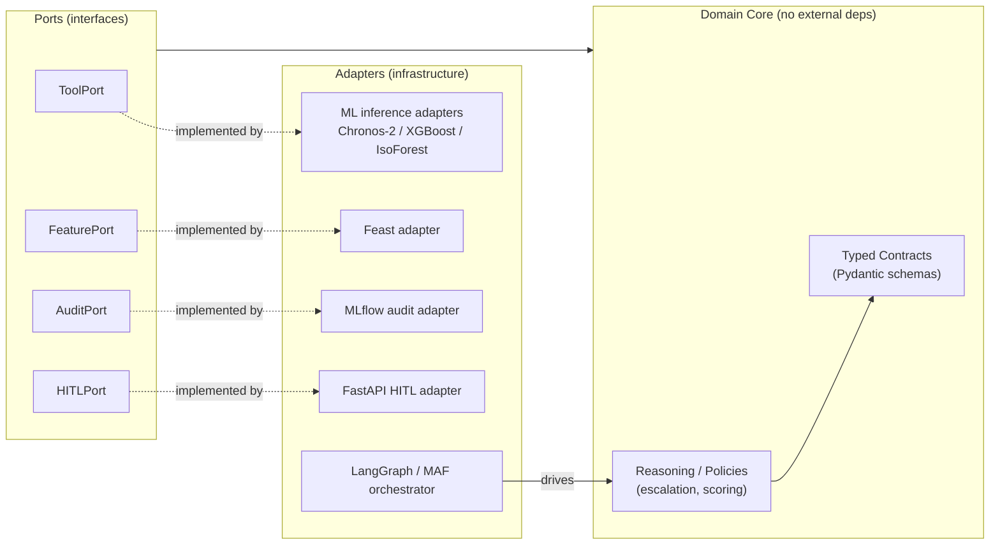

---


## 2. System context (C4 L1)

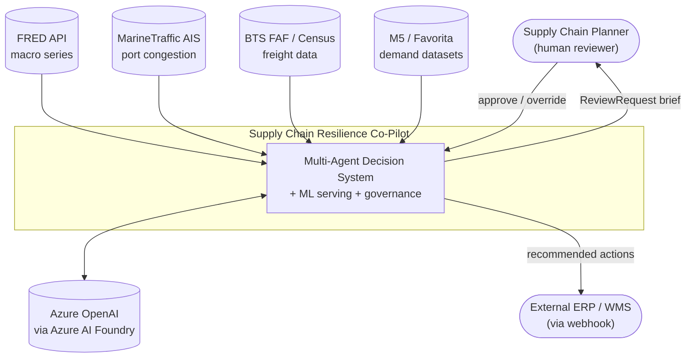

**Boundaries:** the system *ingests* external data and *calls* the LLM as a reasoning utility; it *emits* structured action artefacts to humans (HITL) and to downstream systems (webhook). There is no conversational interface and no autonomous write-back to ERP without approval (PRD §12).

---

## 3. Layered / modular view

Six horizontal layers, each with a single responsibility and a strict downward dependency rule. A layer may only depend on the layer(s) below it through published contracts.

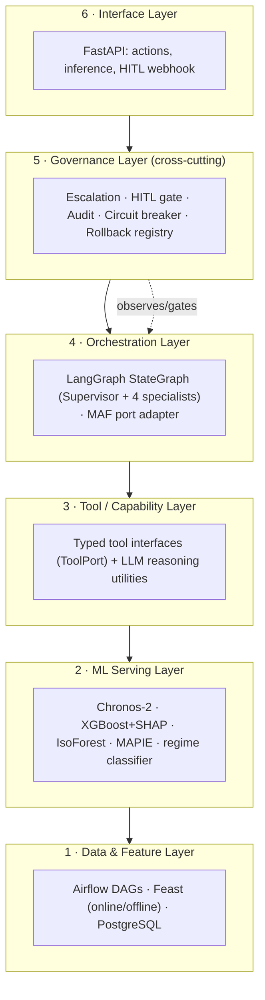

| Layer | Concern | Key tech | Must NOT |
|---|---|---|---|
| 1 — Data & Feature | Ingest, validate, materialise features | `scrc.data`, Airflow, Feast, PostgreSQL | know about agents or models |
| 2 — ML Serving | Produce calibrated predictions + attributions | Chronos-2, XGBoost, IsoForest, SHAP, MAPIE | embed business/escalation logic |
| 3 — Tool / Capability | Expose models & LLM as typed tools | Pydantic contracts, LangChain | hold orchestration state |
| 4 — Orchestration | Sequence agents, fan-out/synthesise | LangGraph `StateGraph` | call raw model code directly |
| 5 — Governance | Tier, gate, audit, rollback | MLflow, policy config in PG | live inside agent business logic |
| 6 — Interface | Expose REST + HITL surface | FastAPI | contain decision logic |

---

## 4. Module boundaries & separation of concerns

Each agent and each model is an independently testable module behind a contract. The **typed contract** is the unit of separation: changing a model implementation cannot break an agent as long as the contract holds.

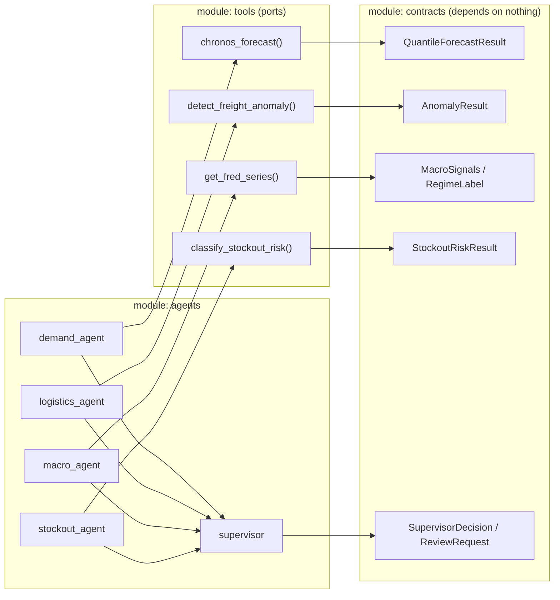

**Rules enforced by this boundary:**
- Agents import *contracts* and *tool interfaces* only — never concrete model classes.
- The Stockout agent consumes the *outputs* (contracts) of the other three, not their internals → conjoint reasoning without coupling.
- The Supervisor consumes only the four typed agent outputs → it can be tested with fixtures, no models needed.

---

## 5. Agent orchestration (LangGraph StateGraph)

The Supervisor fans out to the three independent signal agents in parallel, joins, then runs the Stockout classifier (which needs all three), then synthesises and routes.

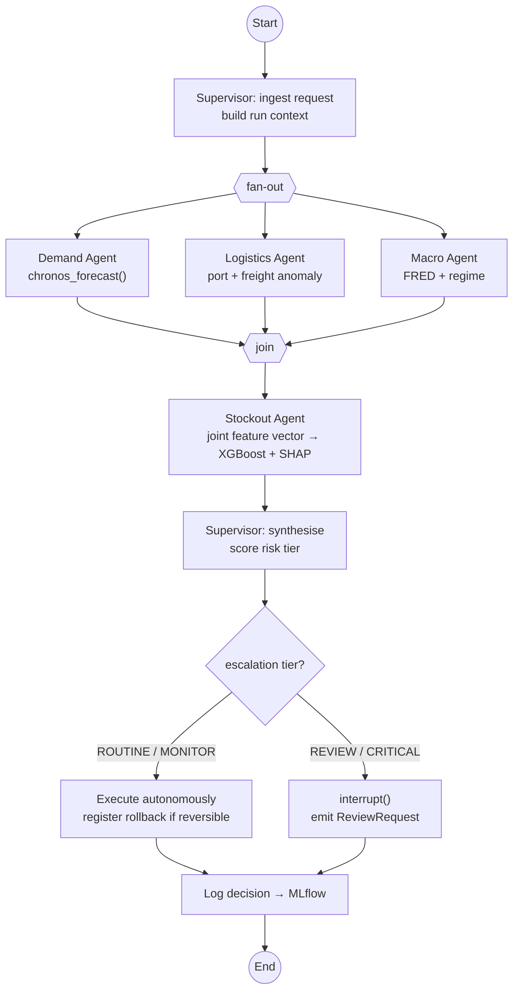

**Resilience rule (P3):** any specialist that fails to return a typed result before timeout emits an escalation token. At the join, a missing output is treated as **maximum uncertainty** — the Supervisor routes conservatively (never hallucinates a value). This is implemented in the join node, not inside each agent.

---

## 6. End-to-end decision flow

The full lifecycle from data freshness to actioned recommendation, spanning all six layers. Note the single OTEL trace that threads the whole cycle.

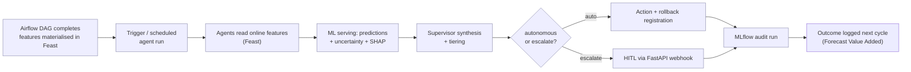

> Every node above emits an OpenTelemetry span ingested by **Opik**; the complete cycle is one trace, and the same captured traces feed the evaluation suite.

---

## 7. HITL escalation sequence

`interrupt()` is code-enforced (P1/P3): the graph durably pauses, the planner receives a *fully explained brief* (not a bare prompt), and approval/override resumes the exact checkpoint.

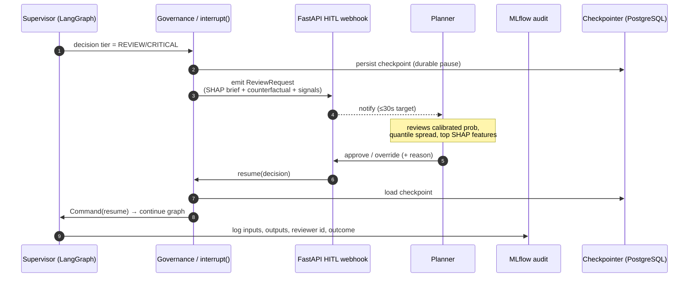

### Escalation policy (governance module, configurable in PostgreSQL)

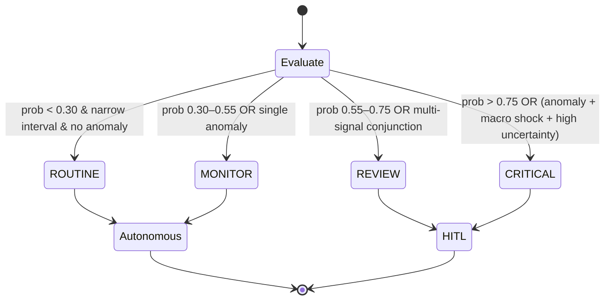

---

## 8. ML-as-Tool serving layer

Each model is wrapped as an MLflow-registered, independently deployed inference service exposing a typed tool. **Only registry-promoted versions are callable** — the tool layer resolves the production alias at call time (P1).

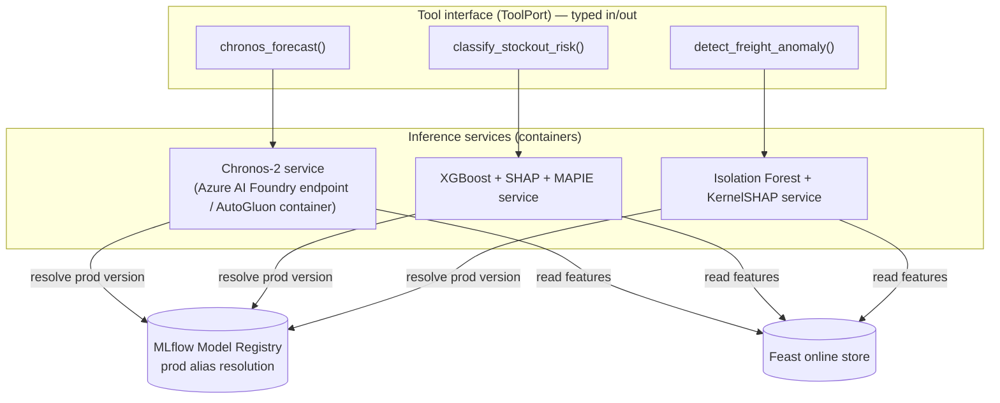

**Output contracts always carry uncertainty + attribution (P2):**

| Tool | Returns | Uncertainty field | Explainability field |
|---|---|---|---|
| `chronos_forecast` | `QuantileForecastResult` | `p10/p50/p90`, `interval_width` | `covariate_flags_used` |
| `classify_stockout_risk` | `StockoutRiskResult` | `calibrated` prob, `confidence_tier` (MAPIE) | `shap_values[]`, `plain_language_brief` |
| `detect_freight_anomaly` | `AnomalyResult` | `anomaly_score` | `top_features[{feature, shap_value}]` |

> **Boundary note:** Azure AutoML benchmarks candidate models during selection only — it is never in this inference path. Chronos-2 is open-source (Apache 2.0), served on Azure, so the runtime stack stays single-cloud.

---

## 9. Data pipeline & feature store

Airflow owns ingestion and validation; Feast owns the read contract for both training (offline) and inference (online). Agents never call source APIs directly — they read materialised features, decoupling inference latency from API rate limits.

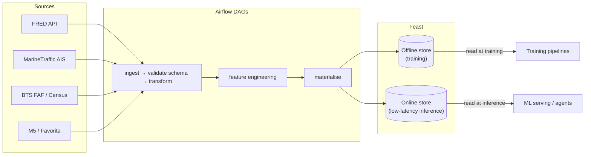

**Rate-limit handling (PRD §13):** AIS responses are cached in Feast with a 4-hour TTL; BTS FAF is the primary logistics signal, AIS is enrichment. All of this lives in the data layer — invisible to agents.

---

## 10. Observability, evaluation & governance

One emission standard (OTEL), two consumers split by concern: **Opik** for agent/LLM traces *and* evaluation; **Prometheus + Grafana** for infra/system metrics. **MLflow** is the durable decision audit log.

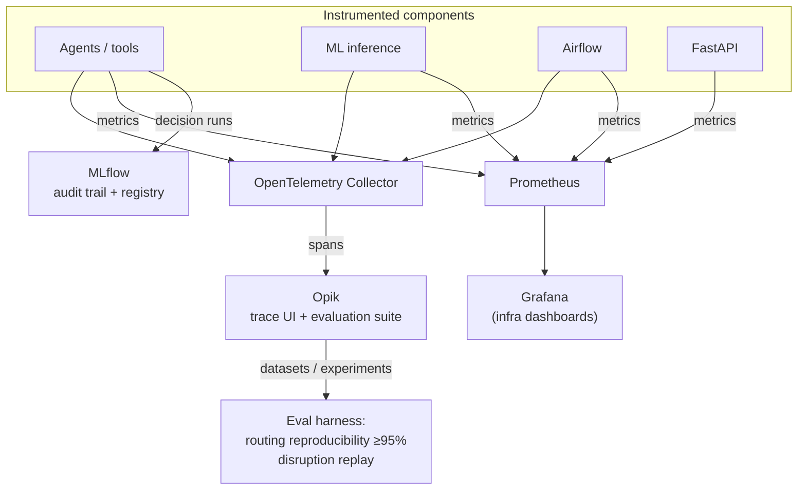

| Concern | Owner | Separation rationale |
|---|---|---|
| Agent/LLM tracing + evaluation | **Opik** | Unifies "what did the agent do" with "was it correct" in one open-source tool (replaces Jaeger + LangSmith) |
| Infra/system metrics | Prometheus + Grafana | Throughput, latency, drift, pipeline health — Opik does not cover infra |
| Decision audit trail | MLflow | Reproducible, queryable Forecast Value Added record (SOC2-style) |
| Policy & autonomy thresholds | PostgreSQL (read by governance) | Config, not code — tunable per SKU/$ impact/reversibility |

---

## 11. MLOps: drift & retraining

The Monitoring Agent applies the *same* HITL governance pattern to the model lifecycle that the Supervisor applies to operations — promotion is gated exactly like a CRITICAL action.

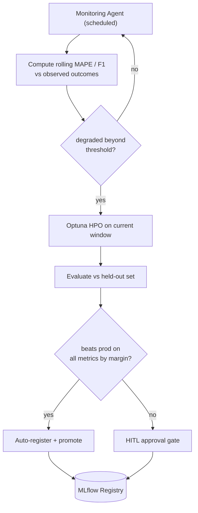

---

## 12. State & persistence model

A single PostgreSQL instance backs four concerns, kept in separate schemas to preserve separation while sharing operational simplicity (PRD §4.3).

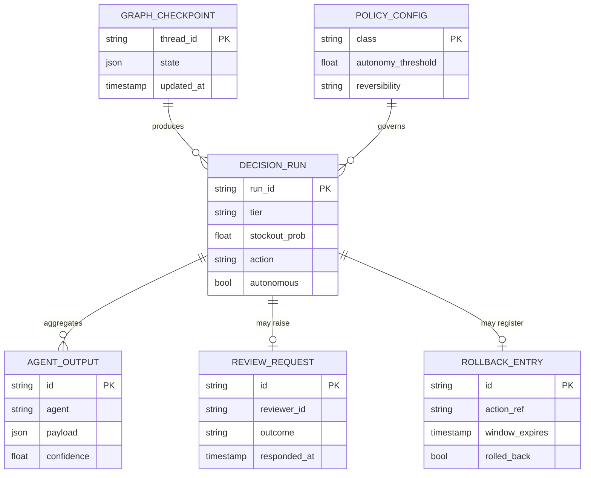

| Schema | Used by | Concern |
|---|---|---|
| `langgraph_checkpoints` | Orchestration | Durable graph state / resume |
| `mlflow` | Governance | Experiment + audit metadata |
| `airflow` | Data layer | Scheduler metadata |
| `feast` | Data layer | Offline + online feature stores |

---

## 13. Deployment topology

12 services via a single `docker-compose up`; Azure-optimised but cloud-agnostic. Grouped by the layer each service serves.

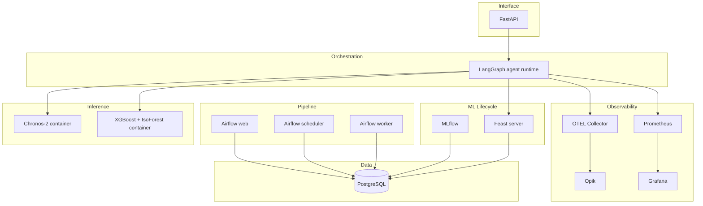

**Cloud mapping (production):** LangGraph + FastAPI → Azure Container Apps · Chronos-2 **and** LLM (Azure OpenAI, primary + secondary deployment) → Azure AI Foundry · PostgreSQL → Azure DB for PostgreSQL Flexible Server · OTEL → Azure Monitor + Opik · artefacts → Azure Blob.

---

## 14. Framework portability (LangGraph → MAF)

P5 in action: the orchestrator is an adapter. The domain core, contracts, tools, and governance are reused unchanged; only the orchestration adapter swaps.

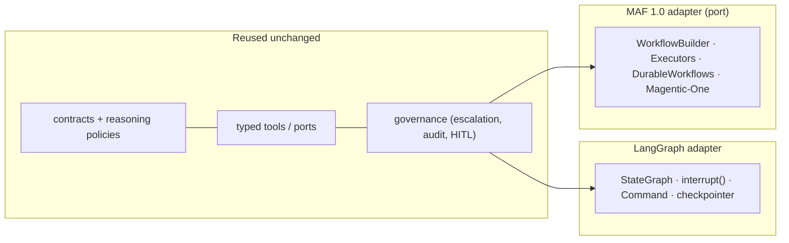

| LangGraph concept | MAF 1.0 equivalent | Notes |
|---|---|---|
| `StateGraph` nodes | `Executors` | one executor per agent |
| `interrupt()` | `DurableWorkflows` pause | both code-enforced HITL |
| `Command` routing | `WorkflowBuilder` edges | conditional routing |
| Checkpointer (PG) | Durable state store | same PostgreSQL backing |

The port is scoped to the Demand + Supervisor sub-graph if full parity proves costly (PRD §13) — and the *differences themselves* are a teaching deliverable (module 6).

---

## 15. Proposed repository structure

A modular monorepo mirroring the layers under a single importable namespace, `scrc`. Dependency direction is enforced by package boundaries (P4): `contracts` ← `tools` ← `agents` ← `orchestration`; `governance` and `observability` are cross-cutting. The rule is not just documented — it is **machine-enforced by `import-linter`** ([.importlinter](../.importlinter)), so a boundary violation fails CI.

```
supplychain_resilience_copilot/
├── docs/                          # PRD, this architecture doc, ADRs, curriculum
├── packages/
│   └── scrc/                      # single importable namespace (e.g. scrc.contracts)
│       ├── contracts/             # Pydantic typed schemas — depends on nothing
│       ├── data/                  # Layer 1: ingestion, transforms, validation
│       ├── ml/                    # training, registration, serving wrappers
│       │   ├── forecasting/       # Chronos-2
│       │   ├── classification/    # XGBoost + SHAP + MAPIE
│       │   └── anomaly/           # Isolation Forest + KernelSHAP
│       ├── tools/                 # ToolPort interfaces + adapters to ml/
│       ├── agents/                # demand/logistics/macro/stockout/supervisor.py
│       ├── orchestration/         # LangGraph graph (state.py, graph.py); maf/ port later
│       ├── governance/            # escalation, HITL, audit, rollback, breakers
│       ├── observability/         # OTEL setup, Opik + Prometheus exporters
│       └── api/                   # FastAPI: actions, inference, HITL webhook
├── pipelines/
│   ├── airflow_dags/              # ingestion + feature DAGs
│   └── feast/                     # feature definitions, repo config
├── eval/                          # Opik datasets, experiments, disruption replay
├── deploy/
│   ├── docker-compose.yml         # service stack (count to reconcile — see §13 note)
│   ├── otel-collector.yaml        # OTEL emission config
│   ├── prometheus.yml             # infra metrics scrape config
│   └── azure/                     # Container Apps / Foundry manifests
├── tests/                         # mirrors packages/ (tests/contracts/ ...)
├── pyproject.toml                 # deps + ruff/mypy/pytest config
├── .importlinter                  # enforces the layer rules above
├── Makefile                       # setup · check · up/down · data-init
└── .env.example
```

> **Namespace note:** §15 originally showed `packages/<layer>/`; the implementation nests these under `packages/scrc/` so imports read `scrc.contracts`, `scrc.tools`, etc. — collision-safe and clean for `import-linter` contracts.

**Test boundary:** each `scrc.*` module is unit-testable in isolation against contracts with fixtures; agents test against fake tools; the Supervisor tests against fake agent outputs; integration tests run the full graph against the Compose stack.

---

# Part II — Architecture review & gap remediation

> A lead-architect pass over Part I identified seven gaps between a *functionally correct* design and a *production-trustworthy, governed* one. This part closes them. Each section states the gap, the design, and where in the layering it lives.

---

## 16. NFR → mechanism traceability

Part I described structure but did not trace the PRD's success criteria to the mechanism that delivers them. Every non-functional requirement now has a single owning mechanism and an enforcement point.

| NFR (PRD §11 / §13) | Target | Mechanism | Enforced in |
|---|---|---|---|
| Routing reproducibility | ≥ 95% identical-input consistency | Deterministic rule-based tiering (LLM does not assign tier) + temperature 0 + structured output + input-hash cache | §17, governance |
| HITL notification latency | ≤ 30 s | Async webhook, durable checkpoint pause, no blocking LLM call on the notify path | §21, §7 |
| Stockout AUC / ECE | ≥ 0.85 / ≤ 0.05 | Eval-as-gate blocks release on regression | §22 |
| Calibrated confidence | isotonic + MAPIE | Calibration in ML serving; tier reads calibrated prob only | §8 |
| Cold start | one `docker-compose up` | Healthchecks + dependency ordering in Compose | §13 |
| Auditability | every decision queryable | Provenance tuple + append-only MLflow; no-audit-no-autonomy invariant | §19, §20 |
| Least-privilege identity | per-agent scoped | Service identity + tool-scoped authz | §18 |

---

## 17. LLM reasoning boundary, determinism & safety

**Gap (G1):** Part I asserted ≥95% routing reproducibility and "LLM never predicts" but gave no enforcing mechanism, and ignored prompt injection from untrusted external data.

### The boundary: what the LLM may and may not do

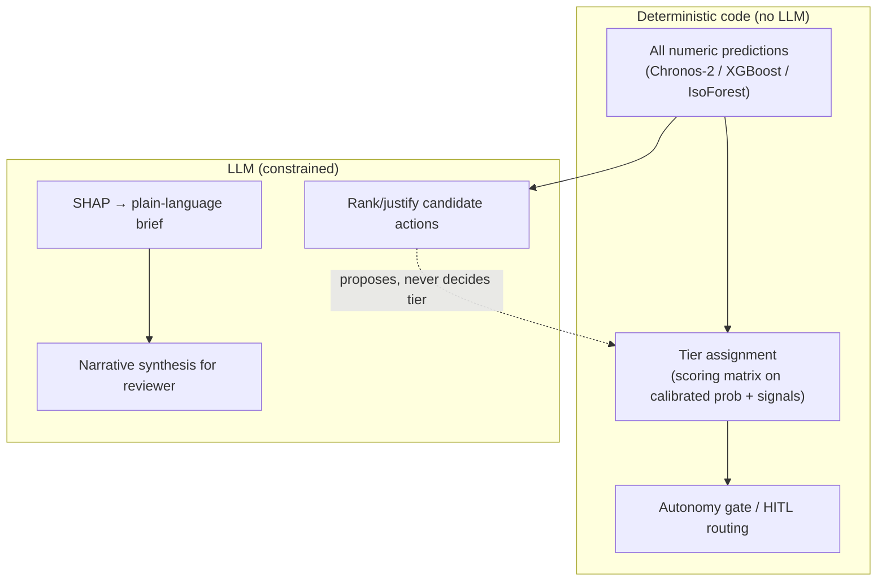

**Invariant:** the *tier and the autonomy decision are pure functions of numeric inputs* — the LLM cannot change a tier. The LLM ranks actions and writes explanations. This is what makes reproducibility achievable: the gate is code, not generation.

### Determinism controls

- **Temperature 0** (or top-1 greedy) for Supervisor synthesis and the Stockout brief.
- **Structured output / strict function-calling** against Pydantic schemas — routing fields are enums; malformed output is rejected and retried, never coerced.
- **Input-hash memoisation**: identical input hash → cached decision (also powers reproducibility eval).
- **CRITICAL tier is fully rule-based** (PRD §13 mitigation) — no LLM in the path for the highest-impact decisions.

### LLM safety & injection defense

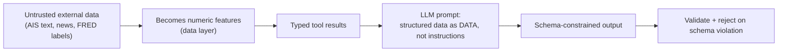

- External data reaches the LLM only as **structured, typed values** — never as free-form instruction text. This collapses most of the prompt-injection surface.
- **Deployment failover** via the LangChain abstraction: a primary Azure OpenAI deployment in Azure AI Foundry → a **secondary Azure OpenAI deployment** (alternate region/model) on error/timeout — single-provider, no second cloud. If both are unavailable → treat as max uncertainty → conservative escalation (never silent autonomy). The provider abstraction is retained so the backbone remains swappable.
- LLM output is validated against schema before it can influence any action; the brief is advisory text attached to a decision already gated by code.

---

## 18. Security architecture & agent identity

**Gap (G2):** PRD §7.4 mandates least-privilege agent identity and an append-only audit log; Part I modelled neither, nor any trust zones or HITL authz.

### Trust zones

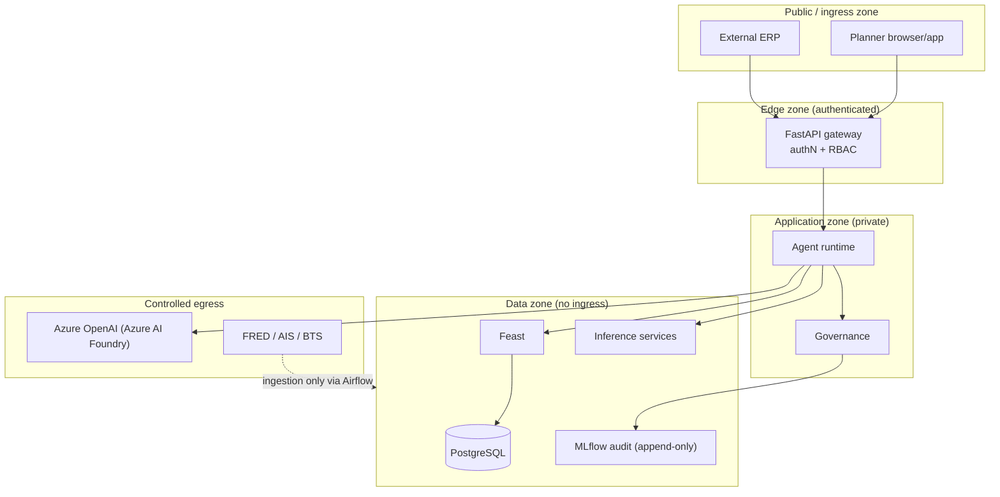

### Controls

| Concern | Control |
|---|---|
| **Agent identity** | Each agent runs under a named service identity scoped to *only* its tool endpoints (least privilege). The Stockout agent cannot call the Chronos endpoint directly; it consumes the Demand agent's contract. |
| **Audit integrity** | Only the **governance layer** writes to the MLflow audit store; it is **append-only / WORM** — no agent has write access. Tampering is out of the agent threat surface. |
| **Secrets** | Local: single `.env` (git-ignored). Cloud: Azure Key Vault + managed identities; no secrets baked into images. |
| **HITL authz** | Approve/override endpoints require authenticated planner identity with RBAC; reviewer ID is captured in the audit run (non-repudiation). |
| **Egress control** | LLM and source-API egress is allow-listed; the data zone has no inbound path except via Airflow ingestion. |

### Threat model (STRIDE-lite, agentic-specific)

| Threat | Vector | Mitigation |
|---|---|---|
| Prompt injection | External text in features | Structured-data-only prompts (§17) |
| Excessive autonomy | Mis-tiered high-impact action | Deterministic CRITICAL routing + autonomy thresholds + rollback registry |
| Tool abuse | Agent calls out-of-scope endpoint | Scoped service identity |
| Audit tampering | Agent rewrites history | Append-only WORM, no agent write access |
| Model poisoning | Bad training data promoted | Eval-as-gate + HITL promotion (§22, §11) |

---

## 19. Failure modes & resilience

**Gap (G3):** resilience was one sentence. A governed system needs an explicit failure taxonomy and one non-negotiable invariant.

> **Invariant — *no audit, no autonomy*.** If a decision cannot be durably persisted to the audit store, the system **must not act autonomously**; it degrades to escalate-only. Autonomy is a privilege contingent on traceability.

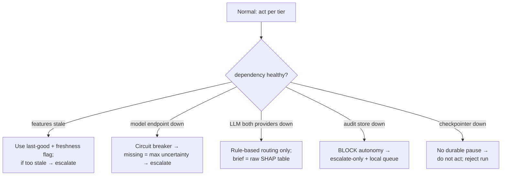

| Component | Failure | Detection | Response |
|---|---|---|---|
| Feast online | stale / unreachable | freshness lag metric | last-good value flagged; escalate if beyond TTL bound |
| Inference service | timeout / 5xx | circuit breaker + OTEL error span | treat output as max uncertainty → conservative route |
| LLM deployment | error / rate limit | deployment error rate | failover to secondary Azure OpenAI deployment (alt region/model); both down → rule-based routing |
| MLflow audit | unreachable | write healthcheck | **block autonomous action**, escalate-only, buffer to local WAL |
| Checkpointer (PG) | unreachable | connection healthcheck | reject new runs (cannot guarantee durable HITL) |
| HITL webhook | delivery fails | ack timeout | retry with idempotency key; fallback notification channel |
| Partial fan-out | 1 of 3 signals missing | join node | proceed with missing = max uncertainty |

**Idempotency:** every decision run and every emitted action carries an idempotency key; rollback entries are registered *before* execution, so a retried run cannot double-act.

---

## 20. Decision provenance & schema versioning

**Gap (G4):** reproducibility and audit are impossible without recording exactly *what produced* a decision; contracts had no evolution strategy.

### Provenance tuple — stamped on every `DECISION_RUN`

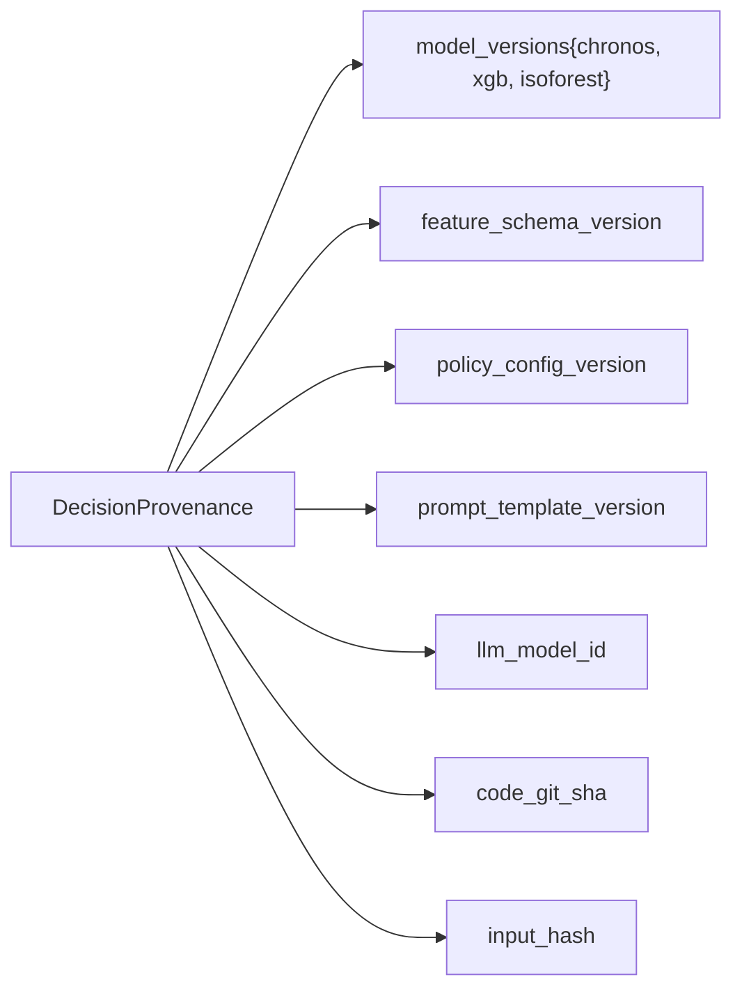

This tuple makes a decision **reconstructable**: given the same input hash and identical versions, the deterministic path reproduces the same tier — the foundation of the ≥95% reproducibility test and of audit defensibility.

### Contract / schema evolution

- Pydantic contracts carry a `schema_version`; evolution is **additive** (new optional fields) within a major version.
- **Consumer-driven contract tests** in CI: agents publish the contract shape they depend on; a producing model change that breaks a consumer fails the build (§22).
- Feature schemas are versioned in Feast (PRD §8.1); a feature schema bump increments `feature_schema_version` in provenance.
- Model output schema and registry version are bound: promoting a model that changes its output contract requires a contract-version bump and consumer re-validation.

---

## 21. Concurrency, scaling & performance budget

**Gap (G5):** no scaling model or latency budget supported the stated targets.

```mermaid
flowchart LR
    Q["Decision requests<br/>(Airflow batch cadence bounds rate)"] --> LB["Stateless agent runtime<br/>(state in checkpointer)"]
    LB --> R1["runtime replica 1"]
    LB --> R2["runtime replica 2"]
    LB --> R3["runtime replica N"]
    R1 & R2 & R3 --> INF["Inference services<br/>(scale independently)"]
    R1 & R2 & R3 --> HITLQ["HITL queue (durable)"]
```

- **Stateless runtime:** all run state lives in the PostgreSQL checkpointer, so agent runtime scales horizontally; a replica can resume any interrupted run.
- **Independent runs** scale out; **within a run**, the three signal agents fan out concurrently (§5).
- **Inference autoscaling** is decoupled — Chronos (Foundry endpoint) and the sklearn container scale on their own latency SLOs.
- **Backpressure:** batch ingestion cadence bounds inbound load; HITL is a durable queue, not a blocking call.

### Latency budget (illustrative, to validate against SLOs)

| Stage | Budget |
|---|---|
| Feature read (Feast online) | ≤ 50 ms |
| 3× parallel inference (max) | ≤ 800 ms |
| Stockout + SHAP | ≤ 400 ms |
| Supervisor synthesis (LLM, temp 0) | ≤ 2 s |
| Tiering + audit write | ≤ 200 ms |
| **→ Decision (auto path)** | **≤ ~3.5 s** |
| `interrupt()` → planner notify | **≤ 30 s** (PRD) — async, off critical path |

---

## 22. CI/CD & evaluation-as-quality-gate

**Gap (G6):** the disruption-replay and reproducibility tests existed but had no enforcement point. Evaluation must be a **release gate**, not a dashboard.

```mermaid
flowchart LR
    PR["PR / commit"] --> S1["lint · type · unit"]
    S1 --> S2["contract tests<br/>(consumer-driven)"]
    S2 --> S3["integration on ephemeral<br/>docker-compose"]
    S3 --> S4{"Eval gate (Opik)"}
    S4 -->|pass| S5["build + push images"]
    S4 -->|fail| BLOCK["block release"]
    S5 --> S6["deploy app"]
    MODELS["Model promotion<br/>(MLflow registry alias)"] -. independent of app deploy .-> S6
```

**Eval gate criteria (block on regression):**

| Check | Threshold |
|---|---|
| Supervisor routing reproducibility | ≥ 95% |
| Disruption replay (COVID, Suez '21, Red Sea '24) | no regression vs golden baseline |
| Stockout AUC / ECE | ≥ 0.85 / ≤ 0.05 |
| IsoForest F1 (injected anomalies) | ≥ 0.70 |

- Disruption scenarios are **versioned golden datasets** in `eval/`, replayed through the full graph; Opik experiments compare against the recorded baseline.
- **Model promotion is decoupled from app deploy:** a new model version flips the registry prod alias (§8) after passing its own eval — no app redeploy needed, and rollback is an alias flip.

---

## 23. Architecture Decision Records

The rationale behind these decisions is recorded as full ADRs in [`adr/`](adr/) (Nygard format — context, decision, consequences, alternatives). See the [ADR index](adr/README.md).

| ADR | Decision | Status |
|---|---|---|
| [0001](adr/0001-deterministic-tiering.md) | Tiering is deterministic code; the LLM never assigns a tier | Accepted |
| [0002](adr/0002-no-audit-no-autonomy.md) | No-audit-no-autonomy invariant | Accepted |
| [0003](adr/0003-hexagonal-orchestrator-adapter.md) | Hexagonal layering; orchestrator (LangGraph/MAF) is an adapter | Accepted |
| [0004](adr/0004-chronos2-over-timegen.md) | Chronos-2 retained (open-source, Azure-hosted) over TimeGEN-1 | Accepted |
| [0005](adr/0005-opik-observability-eval.md) | Opik for tracing + eval; Prometheus/Grafana for infra only | Accepted |
| [0006](adr/0006-single-postgres-schema-separated.md) | Single PostgreSQL, schema-separated, over per-service DBs | Accepted |
| [0007](adr/0007-eval-as-release-gate.md) | Eval-as-release-gate; model promotion decoupled from app deploy | Accepted |
| [0008](adr/0008-azure-openai-via-foundry.md) | Azure OpenAI via Azure AI Foundry; single-provider deployment failover | Accepted |

---

*Architecture v1.1 · Part I (design) + Part II (review & gap remediation) · derived from PRD v1.0 · all diagrams Mermaid · modular hexagonal design with layer-enforced separation of concerns.*
